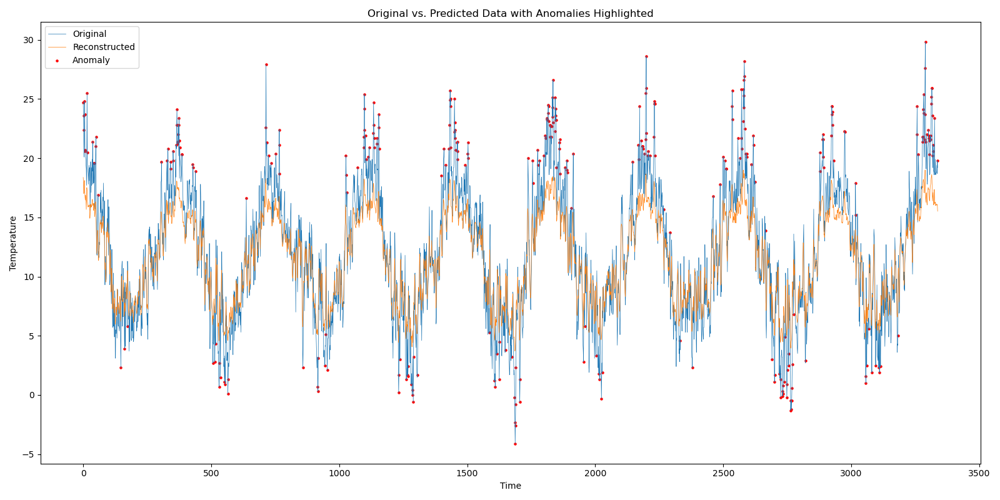

# Univariate Autoencoder for Anomaly Detection in Temperature Data

This project focuses on the development and implementation of a univariate autoencoder designed to detect anomalies within temperature data sets. Utilizing a robust pipeline for processing, training, and evaluating the model, this project showcases the capability to identify outliers in temperature readings effectively.

#### -- Project Status: [Complete]

---

## Project Objective

The goal of this project is to leverage deep learning techniques, specifically a univariate autoencoder, to identify anomalous temperature data points. Anomalies in temperature data can indicate significant environmental changes or sensor malfunctions, making this tool valuable for climate researchers and data scientists alike.

The project not only develops a primary pipeline for training and evaluation but also includes a test pipeline designed to inherit most of the processing stages from the main pipeline, with specific adjustments for preprocessing functions.

## Data Sources

#### Primary Dataset
The primary dataset consists of global daily climate data, including temperature readings across various locations.

**Source:** [Kaggle - Global Daily Climate Data](https://www.kaggle.com/datasets/guillemservera/global-daily-climate-data)

#### Supplementary Dataset
A supplementary dataset provides additional temperature data for London, aiding in the model's robustness and generalization capabilities.

**Source:** [Kaggle - London Weather Data](https://www.kaggle.com/datasets/emmanuelfwerr/london-weather-data)

#### Test Dataset
The test dataset is used to evaluate the model's performance and its ability to generalize to unseen data effectively.

**Source:** [Kaggle - NAB Dataset](https://www.kaggle.com/datasets/boltzmannbrain/nab)

## Technologies

* PyTorch
* Pandas
* PyArrow
* NumPy
* torchinfo
* dataclasses

## Methodologies

- **Data Preprocessing:** Utilizing Pandas and PyArrow for efficient data handling and preprocessing, ensuring the data is in the appropriate format for model training.
- **Model Development:** Building a univariate autoencoder with PyTorch, designed to reconstruct temperature time series data and identify anomalies through reconstruction errors.
- **Pipeline Implementation:** Developing a robust pipeline for data processing, model training, and evaluation. A separate test pipeline inherits the core functionalities with specific adjustments, demonstrating flexibility and modularity in the project design.

---

## Contacts

For further information or to discuss the project in more detail, feel free to reach out.

Email: delstonds@outlook.com
